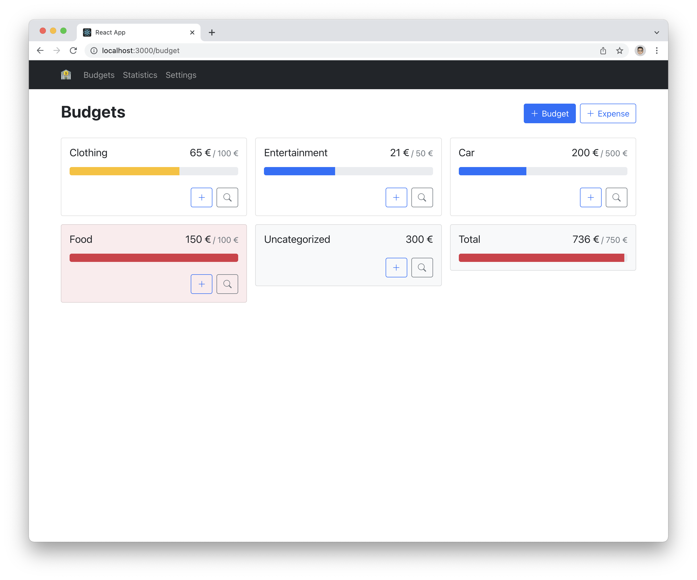

# Budget Planner

Some parts are still under development but the app is fully functional  
- Settings page is not working yet  
- New charts getting added over time  
- Searchbar gets added over time  

## Description

Simple Budget Planner web application to keep track of your finances.  
You can add budgets and expenses. Expenses can be tied to a budget or be uncategorized 
All elements are stored in the localStorage of the browser. Later on a data export function gets added.

## Technologies

This Project uses ReactJS with some React Hooks.  
For the CSS Bootstrap is used and the Icons are provided by Boostrap-Icons.  
The awesome charts are provided with charts.js.

## Preview

## Run

### `npm install`

Install the required dependencies.

### `npm start`

Runs the app in the development mode.\
Open [http://localhost:3000](http://localhost:3000) to view it in the browser.

The page will reload if you make edits.\
You will also see any lint errors in the console.
